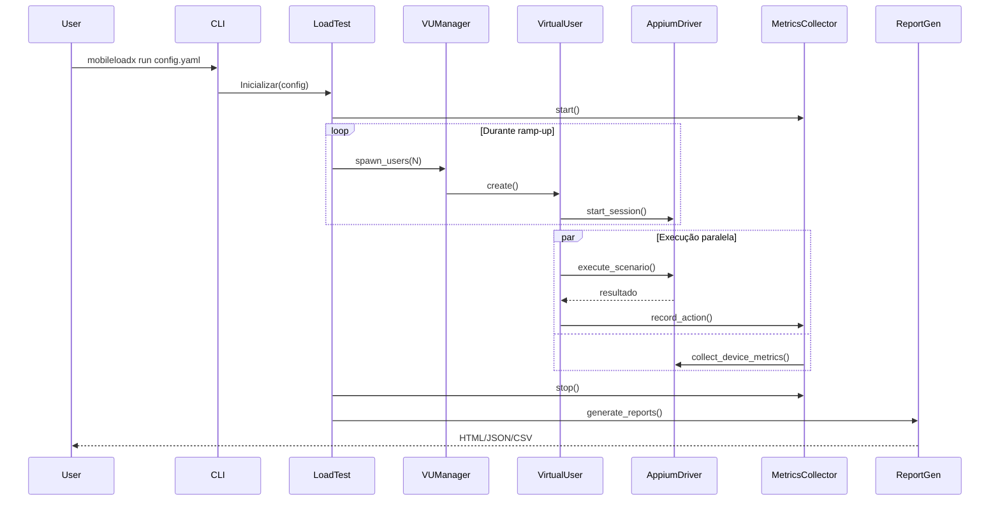

# 🔧 Arquitetura Técnica - MobileLoadX

## Visão Geral

MobileLoadX é um framework multi-camadas projetado para simplicidade de uso e extensibilidade:

```
┌───────────────────────────────────────┐
│     CLI / Python API (User Layer)    │
├───────────────────────────────────────┤
│         Core Engine Layer             │
│  - LoadTest                           │
│  - VirtualUser Manager                │
│  - Scenario Orchestrator              │
├───────────────────────────────────────┤
│      Platform Abstraction Layer       │
│  - Android Driver (UiAutomator2)      │
│  - iOS Driver (XCUITest)              │
├───────────────────────────────────────┤
│      Metrics Collection Layer         │
│  - Device Metrics (CPU, RAM, etc)     │
│  - Action Metrics (timing, errors)    │
├───────────────────────────────────────┤
│       Reporting & Analysis            │
│  - HTML, JSON, CSV generators         │
│  - Threshold validation               │
└───────────────────────────────────────┘
```

## Componentes Principais

### 1. LoadTest Engine

**Responsabilidade:** Orquestração do teste
- Gerenciamento de lifecycle do teste
- Controle de ramp-up/ramp-down
- Thread pool para usuários virtuais
- Coordenação entre componentes

**Padrões de Design:**
- Facade Pattern: Interface simplificada para complexidade interna
- Builder Pattern: Construção fluente de testes

### 2. Virtual User Manager

**Responsabilidade:** Gerenciamento de usuários virtuais
- Criação dinâmica de usuários conforme ramp-up
- Distribuição de carga entre devices
- Isolamento de sessões Appium
- Cleanup de recursos

**Características:**
- Thread-safe
- Pool de conexões Appium
- Retry logic para falhas transientes

### 3. Scenario & Actions

**Responsabilidade:** Definição e execução de workflows
- DSL declarativa para ações
- Suporte a múltiplos locators (id, xpath, accessibility_id)
- Sincronização automática
- Error handling

**Ações Suportadas:**
- `tap`: Click em elemento
- `input`: Entrada de texto
- `scroll`: Scroll vertical/horizontal
- `swipe`: Gesture customizado
- `wait`: Espera explícita
- `back`: Navegação reversa

### 4. Metrics Collector

**Responsabilidade:** Coleta de métricas em tempo real
- Thread dedicada para coleta
- Polling configurável
- Thread-safe storage
- Agregação automática

**Métricas Coletadas:**

#### Device Metrics
- **CPU**: Via `adb shell dumpsys cpuinfo` (Android) / Instruments (iOS)
- **Memory**: Via `adb shell dumpsys meminfo` (Android) / Memory Graph (iOS)
- **Battery**: Via `adb shell dumpsys battery` (Android) / IOKit (iOS)
- **Network**: Via `/proc/net` (Android) / Network Link Conditioner (iOS)

#### Action Metrics
- Timestamp de cada ação
- Duração de execução
- Status (sucesso/falha)
- Erro (se houver)
- Usuário e cenário

### 5. Report Generator

**Responsabilidade:** Geração de relatórios
- HTML com Chart.js para gráficos interativos
- JSON estruturado para integração
- CSV para análise em ferramentas externas
- Formatação responsiva

## Fluxo de Execução



## Decisões de Design

### Por que Appium?

✅ **Cross-platform:** Mesmo código para Android/iOS
✅ **WebDriver Protocol:** Padrão W3C
✅ **Maturidade:** Muito usado na indústria
✅ **Extensibilidade:** Plugins e customizações

### Por que Threading (não Asyncio)?

✅ **Blocking I/O:** Appium é síncrono
✅ **Simplicidade:** Threads são mais intuitivas para esse caso
✅ **Isolation:** Cada thread = sessão isolada
✅ **GIL não é problema:** Maior parte do tempo é I/O

### Por que YAML para Config?

✅ **Human-readable:** Fácil edição
✅ **Estruturado:** Suporta hierarquia
✅ **Popular:** Amplamente usado em DevOps
✅ **Comentários:** Documenta configurações inline

## Extensibilidade

### Plugins de Métricas Customizadas

```python
from mobileloadx.plugins import MetricsPlugin

class MyCustomPlugin(MetricsPlugin):
    def collect(self, context):
        # Sua lógica
        return {"my_metric": value}

test.add_plugin(MyCustomPlugin())
```

### Ações Customizadas

```python
from mobileloadx.core.scenario import Action

class CustomAction(Action):
    def execute(self, driver, platform):
        # Implementação customizada
        pass

scenario.add_action(CustomAction("custom", param=value))
```

### Estratégias de Distribuição de Carga

```python
from mobileloadx.strategies import LoadStrategy

class BurstLoadStrategy(LoadStrategy):
    def calculate_users(self, elapsed):
        # Lógica de burst
        pass

test.set_load_strategy(BurstLoadStrategy())
```

## Performance e Escalabilidade

### Limites Atuais

- **Usuários simultâneos:** ~100-200 por instância
  - Limitado por: Conexões Appium, recursos do host
  - Solução: Distribuição em múltiplas máquinas

- **Devices por host:** ~10-20 emuladores
  - Limitado por: CPU, RAM, virtualização
  - Solução: Devices reais ou cloud devices

### Otimizações

✅ **Connection pooling:** Reutilização de sessões quando possível
✅ **Lazy initialization:** Criação sob demanda
✅ **Efficient metrics:** Coleta assíncrona
✅ **Memory management:** Cleanup automático

## Roadmap Técnico

🔮 **Versão 2.0 (Planejado)**
- [ ] Suporte a distributed testing (múltiplos hosts)
- [ ] Integração com Selenium Grid
- [ ] Real-time dashboard (WebSocket)
- [ ] Machine learning para análise de padrões
- [ ] Suporte Flutter/React Native nativo
- [ ] Gravação e replay de sessões

🔮 **Versão 1.5 (Próximo)**
- [ ] Suporte a gestures avançados
- [ ] Visual regression testing
- [ ] Network throttling
- [ ] Gravação de vídeo durante testes
- [ ] Análise de memory leaks

## Contribuindo

Veja [CONTRIBUTING.md](../CONTRIBUTING.md) para guidelines técnicos.

### Áreas que precisam de contribuição:
- 📊 Dashboards em tempo real
- 🤖 Integração com CI/CD específicos (Jenkins, TeamCity, etc)
- 📱 Suporte a mais plataformas (Flutter, Xamarin, etc)
- 🧪 Mais tipos de ações e gestures
- 📈 Análises e visualizações avançadas
