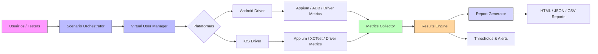

# LinkedIn Posts — Performance App

Abaixo estão versões prontas para publicação: um post completo (com GAP, motivo e diagrama) e uma versão curta para publicação direta.

---

## Post Completo (pronto para LinkedIn)

Apresento o Performance App — um framework open-source pensado para facilitar testes de carga em aplicações móveis e APIs.

GAP do mercado
- Muitas equipes ainda usam scripts ad-hoc ou ferramentas focadas apenas em web/functional testing.
- Testes de performance mobile exigem coleta integrada de métricas de dispositivo (CPU, memória, bateria, FPS) e simulação realista de múltiplos usuários — requisitos que ferramentas tradicionais não cobrem de forma integrada e reprodutível.

Por que criamos
- Precisávamos de uma base leve e extensível para validar regressões e comparar arquiteturas.
- Buscávamos reprodutibilidade de cenários, coleta de métricas de dispositivo + métricas de teste e relatórios acionáveis.
- Objetivo: permitir que equipes de QA e desenvolvedores rodem testes localmente ou em CI com baixa barreira de entrada.

O que o Performance App oferece
- Definição de cenários e orquestração de usuários virtuais
- Coletores configuráveis (CPU, memória, rede, bateria, FPS, response time)
- Relatórios em HTML/JSON/CSV com agregações, thresholds e alertas
- Arquitetura modular (`core/`, `metrics/`, `reporting/`) para extensões e plugins
- Exemplos prontos para começar rápido (`examples/`)

Diagrama (arquitetura simplificada)

Como começar (rápido)
1. Instale dependências: `pip install -r requirements.txt`
2. Rode um exemplo: `python examples/basic_test.py`
3. Consulte a motivação e instruções detalhadas em `docs/PROJECT_MOTIVATION.md`

Chamado à ação
- Experimente, abra issues com cenários reais, contribua com coletores ou melhorias no reporting. Vamos construir uma ferramenta prática e confiável para performance mobile.

#performance #testing #mobile #qa #opensource

---

## Versão Curta (para publicação direta)

Lançamento: Performance App — um framework open-source para testes de carga em apps móveis e APIs. Resolva gaps de performance mobile com cenários reprodutíveis, coleta de métricas de dispositivo e relatórios acionáveis. Saiba mais: `docs/PROJECT_MOTIVATION.md` #performance #testing #opensource
